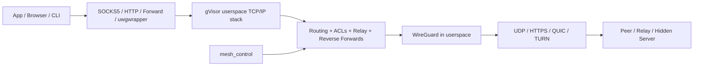

# Userspace WireGuard Socks

Run WireGuard anywhere without root or system routing changes.

`uwgsocks` is a rootless WireGuard gateway, relay, and application router for
machines where a kernel VPN is the wrong tool or where changing host routes is
too invasive.

It runs WireGuard in userspace, bridges traffic into a `gVisor` TCP/IP stack,
and exposes that connectivity through SOCKS5, HTTP, forwards, reverse
forwards, a raw socket API, Linux process interception, optional host-TUN, and
mesh-aware relay logic.

From the end-user perspective, this is what it buys you:

- run WireGuard inside containers and CI jobs without root
- route only the apps you choose without taking over the host default route
- turn a laptop or dev box into a rootless secure egress gateway
- expose local services through the mesh without opening host ports
- route Linux applications through WireGuard when they cannot use SOCKS5 or HTTP directly
- hide WireGuard inside HTTP, HTTPS, QUIC, or TURN carriers on hostile networks
- coordinate direct peer paths with mesh control and relay fallback

## Install

Unix-like hosts:

```bash
curl -fsSL https://raw.githubusercontent.com/reindertpelsma/userspace-wireguard-socks/main/install.sh | sh -s -- uwgsocks
curl -fsSL https://raw.githubusercontent.com/reindertpelsma/userspace-wireguard-socks/main/install.sh | sh -s -- uwgwrapper
curl -fsSL https://raw.githubusercontent.com/reindertpelsma/userspace-wireguard-socks/main/install.sh | sh -s -- turn
```

Build locally:

```bash
bash compile.sh
```

Windows:

- use the release page binaries, or
- run `install.bat` / `install.ps1` from this repository

## First Result

The fastest demo uses the shipped localhost examples.

Terminal 1:

```bash
./uwgsocks --config ./examples/server.yaml
```

Terminal 2:

```bash
./uwgsocks --config ./examples/client.yaml
```

Terminal 3:

```bash
curl --proxy socks5h://127.0.0.1:1080 https://ifconfig.me
curl --proxy http://127.0.0.1:8082 https://ifconfig.me
```

That is a full WireGuard path with userspace proxy ingress, no root, and no
host route changes.

## How It Fits Together



## Main Binaries

| Binary | Purpose |
| --- | --- |
| `uwgsocks` | Main userspace WireGuard runtime, router, relay, proxy, API, and mesh engine |
| `uwgwrapper` | Linux-only process interception path for any app that cannot use SOCKS5 or HTTP directly |
| `turn` | Standalone TURN relay with UDP, TCP, TLS, DTLS, HTTP, HTTPS, and QUIC carriers |
| `uwgsocks-lite` | Reduced feature build for minimal or lower-attack-surface deployments |

## Common Deployment Shapes

- Rootless client proxy: send browser, CLI, or SDK traffic through SOCKS5 or HTTP.
- Rootless server or exit node: terminate inbound WireGuard traffic into normal host sockets.
- Reverse ingress edge: map tunnel-side listeners back to local services.
- Unix-socket service bridge: bind forwards on `unix://` sockets or expose local Unix socket services across WireGuard.
- Process-level tunnel enforcement: force unmodified apps through the mesh with `uwgwrapper`.
- Transport-obfuscated edge: wrap WireGuard in HTTP, QUIC, or TURN when plain UDP is blocked.
- Relay and SD-WAN hub: combine relay ACLs, mesh peer sync, and direct-path discovery.

## Documentation

Start with the guided flow:

- [How-To Index](docs/howto/README.md)
- [01 Simple Client Proxy](docs/howto/01-simple-client-proxy.md)
- [02 Server And Ingress](docs/howto/02-server-and-ingress.md)
- [03 Wrapper Interception](docs/howto/03-wrapper-interception.md)
- [04 Firewall And ACLs](docs/howto/04-firewall-and-acls.md)
- [05 Mesh Coordination](docs/howto/05-mesh-coordination.md)
- [06 Pluggable Transports](docs/howto/06-pluggable-transports.md)
- [07 TURN Relay Ingress](docs/howto/07-turn-relay-ingress.md)
- [08 Reference Map](docs/howto/08-reference-map.md)
- [09 Unix Socket Forwards](docs/howto/09-unix-socket-forwards.md)

Deep reference docs:

- [Configuration behavior](docs/reference/configuration.md)
- [Full config map](docs/reference/config-reference.md)
- [ACL model](docs/reference/acls.md)
- [Mesh control](docs/reference/mesh-control.md)
- [Proxy routing order](docs/reference/proxy-routing.md)
- [Socket protocol](docs/reference/socket-protocol.md)
- [Transport modes](docs/reference/transport-modes.md)
- [TURN integration and relay modes](docs/reference/turn.md)
- [Compatibility](docs/reference/compatibility.md)
- [Testing](docs/reference/testing.md)
- [Standalone TURN daemon](turn/README.md)

## Platform Snapshot

- Repeatedly exercised: Linux, macOS, Windows, FreeBSD
- Linux-only component: `uwgwrapper`
- Additional cross-build targets exist, but not every build target is claimed
  as production-ready runtime support

See [docs/reference/compatibility.md](docs/reference/compatibility.md) for the
current matrix and caveats.

## Companion Project

If you want a browser UI, managed daemon lifecycle, protected public subdomain
ingress, and multi-user control-plane workflows, use
[simple-wireguard-server](https://github.com/reindertpelsma/simple-wireguard-server)
with `uwgsocks`.

## License

ISC License
